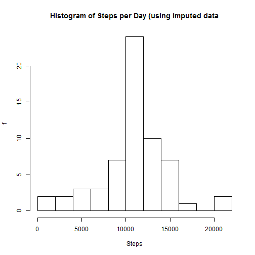
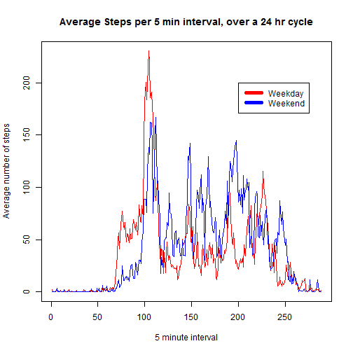

The assignment instructions were taken from here:  
https://class.coursera.org/repdata-035/human_grading/view/courses/972599/assessments/3/submissions

The data file was linked as: https://d396qusza40orc.cloudfront.net/repdata%2Fdata%2Factivity.zip  
  
  Well, straight into it then.  
  
  Loading and preprocessing the data
-------------------------------


```r
library(RCurl)
```

```
## Warning: package 'RCurl' was built under R version 3.2.2
```

```
## Loading required package: bitops
```

```r
#setInternet2(use = TRUE)
#linkedfile <- "http://d396qusza40orc.cloudfront.net/repdata%2Fdata%2Factivity.zip"  
#download.file <- (linkedfile)


unzip ("activity.zip")
originalData <- read.csv("activity.csv")
dim(originalData)  
```

```
## [1] 17568     3
```

```r
sum(!complete.cases(originalData))
```

```
## [1] 2304
```
<h3>What is mean total number of steps taken per day?</h3>


>-For this part of the assignment, you can ignore the missing values in the dataset.  
>-Calculate the total number of steps taken per day.  
>-....  
>-Make a histogram of the total number of steps taken each day  


```r
PerDayData <- originalData  #keeps original data set as is;
StepsPerDay <- tapply (PerDayData$steps, PerDayData$date, sum)
hist(StepsPerDay, breaks=11, 
     xlab = "Steps", 
     ylab = "f", 
     main = "Histogram of Steps per Day")
```

 

>-Calculate and report the mean and median of the total number of steps taken per day.

```r
mean(StepsPerDay, na.rm=TRUE)
```

```
## [1] 10766.19
```

```r
median(StepsPerDay, na.rm=TRUE)
```

```
## [1] 10765
```
<h1> What is the average daily activity pattern?</h1>  
  
>  - Make a time series plot (i.e. type = "l") of the 5-minute interval (x-axis) and the average number of steps taken, averaged across all days (y-axis)
>  


```r
DAPData <- originalData
avgInterval <- tapply(DAPData$steps, DAPData$interval, mean, na.rm = TRUE)
plot(avgInterval, type = "l", 
     xlab = "5 min interval", 
     ylab = "Average steps", 
     main = "Average steps per 5 minute interval over a 24h cycle")
```

 

>- Which 5-minute interval, on average across all the days in the dataset, contains the maximum number of steps?  

```r
max(avgInterval)
```

```
## [1] 206.1698
```

```r
which.max(avgInterval)
```

```
## 835 
## 104
```
The 104th 5 min interval has the maximum number of steps.  

```r
avgInterval[104]
```

```
##      835 
## 206.1698
```
The 104th 5 min interval is labelled as "835" which is (probably) the 5 minute period between 08:35 and 08:40 AM.    

<h1>Imputing missing values </h1>  
  
>- Calculate and report the total number of missing values in the dataset (i.e. the total number of rows with NAs)  

```r
dim(originalData)
```

```
## [1] 17568     3
```

```r
sum(is.na(originalData))
```

```
## [1] 2304
```
There are 2304 rows with missing values.  
  
  
>- Devise a strategy for filling in all of the missing values in the dataset. The strategy does not need to be sophisticated. For example, you could use the mean/median for that day, or the mean for that 5-minute interval, etc.

```
## [1] "OK, I will use the average for that interval, but only replace NA values..."
```

>- Create a new dataset that is equal to the original dataset but with the missing data filled in.

```r
imputData <- originalData
for (i in 1:nrow(imputData))
  { if( is.na(imputData$steps[i]))
    { yy<- toString(imputData[i,3])  ## returns a numeric value for interva, converts toString
      imputData$steps[i]<- avgInterval[[yy]]  ####aaarrggh; double [[  ]] was the breakthrough for me!
    }
  }
print("New dataset is called 'imputData'")
```

```
## [1] "New dataset is called 'imputData'"
```
>-Make a histogram of the total number of steps taken each day and Calculate and report the mean and median total number of steps taken per day. Do these values differ from the estimates from the first part of the assignment? What is the impact of imputing missing data on the estimates of the total daily number of steps?  
  

```r
# using the same formula as at the start:
# originally used: 
# PerDayData <- originalData  #keeps original data set as is;
# StepsPerDay <- tapply (PerDayData$steps, PerDayData$date, sum)

ImputedStepsPerDay <- tapply(imputData$steps, imputData$date, sum)

hist(ImputedStepsPerDay, breaks=11, 
     xlab = "Steps", 
     ylab = "f", 
     main = "Histogram of Steps per Day (using imputed data")
```

 

```r
#StepsPerDay was the original data (including missing values)
mean(StepsPerDay, na.rm = TRUE)
```

```
## [1] 10766.19
```

```r
mean(StepsPerDay)
```

```
## [1] NA
```

```r
#ImputedStepsPerDay uses the "imputed" data, ie. no missing values
mean(ImputedStepsPerDay)
```

```
## [1] 10766.19
```

```r
median(StepsPerDay, na.rm = TRUE)
```

```
## [1] 10765
```

```r
median(ImputedStepsPerDay)
```

```
## [1] 10766.19
```


```
## [1] "The Mean and Median of the imputed data are almost identical to the original, with no need to exclude 'na' values during calculations."
```


```r
sum(originalData$steps, na.rm = TRUE)
```

```
## [1] 570608
```

```r
sum(imputData$steps) - sum(originalData$steps, na.rm = TRUE)
```

```
## [1] 86129.51
```

```
## [1] "There is a difference in the sums of daily steps; in the order of +15% for the imputed data when compared with the original data. "
```

<h1> Are there differences in activity patterns between weekdays and weekends? </h1>  
  >- Create a new factor variable in the dataset with two levels -- "weekday" and "weekend" indicating whether a given date is a weekday or weekend day  
  

```r
library(timeDate)
```

```
## Warning: package 'timeDate' was built under R version 3.2.3
```

```r
for (i in 1:nrow(imputData))
   {
   if (isWeekday(imputData[i,"date"]))
       {imputData[i,"DayType"] <- "Weekday"}
   if (!isWeekday(imputData[i,"date"]))
     { imputData[i,"DayType"] <- "Weekend"}
   }

avgSteps_Weekday = tapply(subset(imputData, DayType == "Weekday")$steps, 
    subset(imputData, DayType == "Weekday")$interval, mean, na.rm = TRUE)
avgSteps_Weekend = tapply(subset(imputData, DayType == "Weekend")$steps, 
    subset(imputData, DayType == "Weekend")$interval, mean, na.rm = TRUE)
  
par(mfrow = c(1, 1))

plot(avgSteps_Weekday, type = "l", 
     xlab = "5 minute interval", 
     ylab = "Average number of steps", 
     col = "red", 
     main = "Average Steps per 5 min interval, over a 24 hr cycle")
lines(avgSteps_Weekend, type = "l", 
     xlab = "5 minute interval", 
     col = "blue",
     ylab = "Average number of steps")
     #main = "Average Steps per 5 min interval, over a 24 hr cycle, Weekend")
legend(200,200, 
       c("Weekday", "Weekend"), lty=c(1,1), lwd=c(5,5),
       col=c("red","blue"))
```

 


Enjoy!
